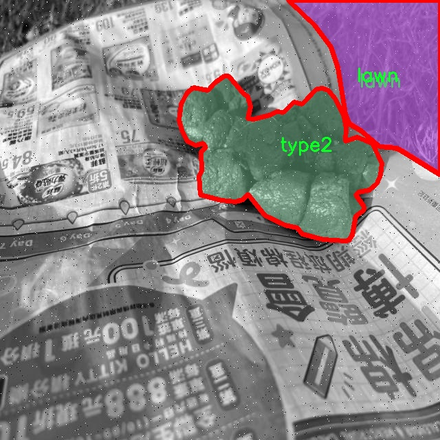

# 宠物排泄物图像分割系统源码＆数据集分享
 [yolov8-seg-p6＆yolov8-seg-LAWDS等50+全套改进创新点发刊_一键训练教程_Web前端展示]

### 1.研究背景与意义

项目参考[ILSVRC ImageNet Large Scale Visual Recognition Challenge](https://gitee.com/YOLOv8_YOLOv11_Segmentation_Studio/projects)

项目来源[AAAI Global Al lnnovation Contest](https://kdocs.cn/l/cszuIiCKVNis)

研究背景与意义

随着城市化进程的加快，宠物数量的急剧增加给城市环境带来了诸多挑战，其中宠物排泄物的管理尤为突出。宠物排泄物不仅影响城市的美观，还可能成为公共卫生隐患，传播疾病，影响生态环境。因此，开发有效的宠物排泄物管理系统，尤其是图像识别与分割技术，已成为当前研究的热点之一。近年来，深度学习技术的迅猛发展为图像处理领域带来了新的机遇，尤其是目标检测与分割任务中，YOLO（You Only Look Once）系列模型凭借其高效性和准确性，成为了研究者们的首选工具。

本研究旨在基于改进的YOLOv8模型，构建一个高效的宠物排泄物图像分割系统。YOLOv8作为YOLO系列的最新版本，具有更强的特征提取能力和更快的推理速度，能够在复杂环境中准确识别和分割目标。通过对YOLOv8模型的改进，我们期望提升其在宠物排泄物图像分割任务中的表现，进而为宠物管理提供技术支持。

在数据集方面，本研究使用了POOP_SR数据集，该数据集包含2600张图像，涵盖了9个类别，包括室内、草坪及多种类型的宠物排泄物。这一丰富的数据集为模型的训练和评估提供了坚实的基础。多样化的图像来源和类别设置，使得模型能够在不同场景下进行有效的学习和适应，从而提高其在实际应用中的泛化能力。

研究的意义不仅体现在技术层面，更在于其对社会环境的积极影响。通过实现高效的宠物排泄物识别与分割，能够帮助城市管理者更好地监控和管理宠物排泄物，提升城市环境卫生水平。此外，该系统的推广应用也将提高宠物主人对环境保护的意识，促进文明养宠行为的形成，进而改善城市的整体生活质量。

在技术应用层面，基于改进YOLOv8的宠物排泄物图像分割系统还可以与智能城市管理系统相结合，实现实时监控与数据分析。通过对收集到的图像数据进行分析，可以为城市规划和公共设施建设提供科学依据，推动智能化管理的发展。这种结合不仅提升了技术的应用价值，也为未来的研究提供了新的方向。

综上所述，本研究在宠物排泄物管理领域具有重要的理论价值和实际意义。通过改进YOLOv8模型，构建高效的图像分割系统，不仅为宠物管理提供了新的技术手段，也为提升城市环境卫生和推动社会文明进步贡献了力量。未来，我们期待这一研究能够在更广泛的领域内得到应用，推动相关技术的不断发展与创新。

### 2.图片演示


##### 注意：由于此博客编辑较早，上面“2.图片演示”和“3.视频演示”展示的系统图片或者视频可能为老版本，新版本在老版本的基础上升级如下：（实际效果以升级的新版本为准）

  （1）适配了YOLOV8的“目标检测”模型和“实例分割”模型，通过加载相应的权重（.pt）文件即可自适应加载模型。

  （2）支持“图片识别”、“视频识别”、“摄像头实时识别”三种识别模式。

  （3）支持“图片识别”、“视频识别”、“摄像头实时识别”三种识别结果保存导出，解决手动导出（容易卡顿出现爆内存）存在的问题，识别完自动保存结果并导出到tempDir中。

  （4）支持Web前端系统中的标题、背景图等自定义修改，后面提供修改教程。

  另外本项目提供训练的数据集和训练教程,暂不提供权重文件（best.pt）,需要您按照教程进行训练后实现图片演示和Web前端界面演示的效果。

### 3.视频演示

[3.1 视频演示](https://www.bilibili.com/video/BV1v2S7YuEcZ/)

### 4.数据集信息展示

##### 4.1 本项目数据集详细数据（类别数＆类别名）

nc: 9
names: ['Indoor', 'lawn', 'type1', 'type2', 'type3', 'type4', 'type5', 'type6', 'type7']


##### 4.2 本项目数据集信息介绍

数据集信息展示

在现代计算机视觉领域，图像分割技术的应用日益广泛，尤其是在特定场景下的物体识别与分类。为此，我们构建了一个专门用于训练改进YOLOv8-seg的宠物排泄物图像分割系统的数据集，命名为“POOP_SR”。该数据集的设计旨在提高模型在不同环境下对宠物排泄物的检测与分割能力，进而推动智能宠物管理和环境卫生监测的发展。

“POOP_SR”数据集包含了9个类别，具体类别包括“Indoor”（室内）、“lawn”（草坪）、以及多种类型的宠物排泄物，分别标记为“type1”至“type7”。这些类别的设置不仅考虑了不同环境对宠物排泄物的影响，还细分了排泄物的类型，以便于模型能够更精确地识别和分割不同的图像特征。例如，“Indoor”类别主要涵盖在室内环境中拍摄的宠物排泄物图像，这类图像通常具有较复杂的背景和光照条件，增加了分割的难度。而“lawn”类别则专注于户外草坪环境中的排泄物，通常背景较为简单，便于进行特征提取。

在类型分类方面，type1至type7则分别代表了不同种类的宠物排泄物，这种细分不仅能够帮助模型学习到更丰富的特征信息，还能在实际应用中提供更为精确的分类结果。例如，type1可能代表某种特定犬种的排泄物，而type2则可能对应另一种犬种或猫咪的排泄物。通过这种方式，数据集能够为模型提供多样化的训练样本，使其在面对不同类型的排泄物时，能够更好地进行识别和分割。

数据集的构建过程中，我们特别注重图像的多样性和代表性。所有图像均来自真实场景拍摄，确保了数据集的真实性和实用性。为了增强模型的泛化能力，数据集中包含了不同光照、天气、拍摄角度等条件下的图像，确保模型在各种环境下都能保持良好的性能。此外，为了提高数据集的可用性，我们还进行了数据增强处理，包括旋转、缩放、翻转等操作，以增加样本的多样性。

在标注方面，所有图像均经过专业人员的仔细标注，确保每个类别的准确性和一致性。我们采用了严格的标注标准，确保每个图像中的排泄物都能被准确地框定和分类，这为后续的模型训练提供了坚实的基础。

总之，“POOP_SR”数据集不仅为改进YOLOv8-seg的宠物排泄物图像分割系统提供了丰富的训练数据，还为未来相关研究提供了重要的参考。通过对不同环境和类型的综合考虑，该数据集将有助于提升智能宠物管理系统的智能化水平，为改善城市环境卫生和提升宠物主人对宠物行为的管理能力做出贡献。




### 5.全套项目环境部署视频教程（零基础手把手教学）

[5.1 环境部署教程链接（零基础手把手教学）](https://www.bilibili.com/video/BV1jG4Ve4E9t/?vd_source=bc9aec86d164b67a7004b996143742dc)


[5.2 安装Python虚拟环境创建和依赖库安装视频教程链接（零基础手把手教学）](https://www.bilibili.com/video/BV1nA4VeYEze/?vd_source=bc9aec86d164b67a7004b996143742dc)

### 6.手把手YOLOV8-seg训练视频教程（零基础小白有手就能学会）

[6.1 手把手YOLOV8-seg训练视频教程（零基础小白有手就能学会）](https://www.bilibili.com/video/BV1cA4VeYETe/?vd_source=bc9aec86d164b67a7004b996143742dc)


按照上面的训练视频教程链接加载项目提供的数据集，运行train.py即可开始训练



     Epoch   gpu_mem       box       obj       cls    labels  img_size
     1/200     0G   0.01576   0.01955  0.007536        22      1280: 100%|██████████| 849/849 [14:42<00:00,  1.04s/it]
               Class     Images     Labels          P          R     mAP@.5 mAP@.5:.95: 100%|██████████| 213/213 [01:14<00:00,  2.87it/s]
                 all       3395      17314      0.994      0.957      0.0957      0.0843

     Epoch   gpu_mem       box       obj       cls    labels  img_size
     2/200     0G   0.01578   0.01923  0.007006        22      1280: 100%|██████████| 849/849 [14:44<00:00,  1.04s/it]
               Class     Images     Labels          P          R     mAP@.5 mAP@.5:.95: 100%|██████████| 213/213 [01:12<00:00,  2.95it/s]
                 all       3395      17314      0.996      0.956      0.0957      0.0845

     Epoch   gpu_mem       box       obj       cls    labels  img_size
     3/200     0G   0.01561    0.0191  0.006895        27      1280: 100%|██████████| 849/849 [10:56<00:00,  1.29it/s]
               Class     Images     Labels          P          R     mAP@.5 mAP@.5:.95: 100%|███████   | 187/213 [00:52<00:00,  4.04it/s]
                 all       3395      17314      0.996      0.957      0.0957      0.0845


### 7.50+种全套YOLOV8-seg创新点代码加载调参视频教程（一键加载写好的改进模型的配置文件）

[7.1 50+种全套YOLOV8-seg创新点代码加载调参视频教程（一键加载写好的改进模型的配置文件）](https://www.bilibili.com/video/BV1Hw4VePEXv/?vd_source=bc9aec86d164b67a7004b996143742dc)

### 8.YOLOV8-seg图像分割算法原理

原始YOLOV8-seg算法原理

YOLOv8-seg算法是YOLO系列目标检测算法的最新版本，结合了目标检测与图像分割的能力，旨在实现更高效、更精确的物体识别与分割。该算法的设计思想基于YOLOv8的架构，通过引入图像分割模块，使得YOLOv8-seg不仅能够检测目标物体的位置，还能精确地划分出物体的边界，从而为后续的图像分析和处理提供更为丰富的信息。

在YOLOv8-seg的核心架构中，输入层负责接收并预处理图像数据，经过一系列的图像增强技术，包括马赛克增强、混合增强、空间扰动和颜色扰动，来提高模型的鲁棒性和泛化能力。预处理后的图像被送入主干网络，主干网络采用了改进的C2f模块，该模块在YOLOv5的基础上进行了优化，增加了更多的分支以增强梯度流动，进而提高特征提取的效率。通过这一系列的卷积操作，主干网络能够有效地提取出图像中的多层次特征，为后续的检测和分割任务奠定基础。

在特征提取之后，YOLOv8-seg算法利用特征金字塔网络（FPN）和路径聚合网络（PAN）结构，充分融合不同尺度的特征图信息。这一过程不仅增强了模型对多尺度目标的检测能力，也为分割任务提供了丰富的上下文信息。通过这种特征融合，YOLOv8-seg能够在不同分辨率下保持较高的检测精度，同时有效处理复杂场景中的物体重叠和遮挡问题。

YOLOv8-seg的检测头采用了解耦结构，这一设计使得分类和定位任务能够独立进行。具体而言，模型通过两个并行的卷积分支分别计算目标的类别和位置损失。这种解耦的设计理念不仅提高了模型的灵活性，还能够在不同任务之间实现更好的信息共享。在分类损失方面，YOLOv8-seg采用了变焦损失（Varifocal Loss），该损失函数通过对正负样本进行加权，能够更有效地处理类别不平衡问题，提升模型对高质量样本的关注度。而在边界框回归损失方面，YOLOv8-seg结合了CIoU损失和DFL损失，进一步提高了目标定位的精度。

在图像分割方面，YOLOv8-seg通过引入新的分割头来实现像素级的分类。该分割头与检测头相辅相成，能够在目标检测的基础上，提供每个像素的类别信息。通过这种方式，YOLOv8-seg不仅能够准确识别目标物体的位置，还能细致地划分出物体的轮廓。这一特性在诸如医学影像分析、自动驾驶等应用场景中具有重要的实际意义。

此外，YOLOv8-seg在标签分配策略上也进行了创新，采用了动态标签分配策略，以提高正负样本的匹配效率。与YOLOv6的TOOD策略相似，YOLOv8-seg在标签分配时只关注目标框和目标分数，避免了传统方法中对候选框的依赖。这一策略使得模型在处理不同数据集时，能够更灵活地适应数据的分布特征，提升了模型的整体性能。

综上所述，YOLOv8-seg算法通过对YOLOv8的结构优化和图像分割模块的引入，实现了目标检测与分割的有机结合。其创新的网络架构、损失函数设计和标签分配策略，使得YOLOv8-seg在目标检测和图像分割任务中均表现出色。未来，随着算法的不断优化和应用场景的拓展，YOLOv8-seg有望在更多领域发挥重要作用，为智能视觉系统的发展提供强有力的支持。


### 9.系统功能展示（检测对象为举例，实际内容以本项目数据集为准）

图9.1.系统支持检测结果表格显示

  图9.2.系统支持置信度和IOU阈值手动调节

  图9.3.系统支持自定义加载权重文件best.pt(需要你通过步骤5中训练获得)

  图9.4.系统支持摄像头实时识别

  图9.5.系统支持图片识别

  图9.6.系统支持视频识别

  图9.7.系统支持识别结果文件自动保存

  图9.8.系统支持Excel导出检测结果数据


### 10.50+种全套YOLOV8-seg创新点原理讲解（非科班也可以轻松写刊发刊，V11版本正在科研待更新）

#### 10.1 由于篇幅限制，每个创新点的具体原理讲解就不一一展开，具体见下列网址中的创新点对应子项目的技术原理博客网址【Blog】：


[10.1 50+种全套YOLOV8-seg创新点原理讲解链接](https://gitee.com/qunmasj/good)

#### 10.2 部分改进模块原理讲解(完整的改进原理见上图和技术博客链接)【如果此小节的图加载失败可以通过CSDN或者Github搜索该博客的标题访问原始博客，原始博客图片显示正常】
### YOLOv8简介
Yolov8主要借鉴了Yolov5、Yolov6、YoloX等模型的设计优点，其本身创新点不多，偏重在工程实践上，具体创新如下:
·提供了一个全新的SOTA模型（包括P5 640和P6 1280分辨率的目标检测网络和基于YOLACT的实例分割模型)。并且，基于缩放系数提供了N/S/M/IL/X不同尺度的模型，以满足不同部署平台和应用场景的需求。
●Backbone:同样借鉴了CSP模块思想，不过将Yolov5中的C3模块替换成了C2f模块，实现了进一步轻量化，同时沿用Yolov5中的SPPF模块，并对不同尺度的模型进行精心微调，不再是无脑式—套参数用于所有模型，大幅提升了模型性能。
●Neck:继续使用PAN的思想，但是通过对比YOLOv5与YOLOv8的结构图可以看到，YOLOv8移除了1*1降采样层。
●Head部分相比YOLOv5改动较大，Yolov8换成了目前主流的解耦头结构(Decoupled-Head)，将分类和检测头分离，同时也从Anchor-Based换成了Anchor-Free。
●Loss计算:使用VFLLoss作为分类损失(实际训练中使用BCE Loss);使用DFLLoss+ClOU Loss作为回归损失。
●标签分配: Yolov8抛弃了以往的loU分配或者单边比例的分配方式，而是采用Task-Aligned Assigner正负样本分配策略。
#### Yolov8网络结构
Yolov8模型网络结构图如下图所示。


#### Backbone
Yolov8的Backbone同样借鉴了CSPDarkNet结构网络结构，与Yolov5最大区别是，Yolov8使用C2f模块代替C3模块。具体改进如下:
·第一个卷积层的Kernel size从6×6改为3x3。
·所有的C3模块改为C2f模块，如下图所示，多了更多的跳层连接和额外Split操作。。Block数由C3模块3-6-9-3改为C2f模块的3-6-6-3。

### 上下文引导网络（CGNet）简介


高准确率的模型（蓝点），由图像分类网络转化而来且参数量大，因此大多不适于移动设备。
低分辨率的小模型（红点），遵循分类网络的设计方式，忽略了分割特性，故而效果不好。
#### CGNet的设计：
为了提升准确率，用cgnet探索语义分割的固有属性。对于准确率的提升，因为语义分割是像素级分类和目标定位，所以空间依赖性和上下文信息发挥了重要作用。因此，设计cg模块，用于建模空间依赖性和语义上下文信息。
- 1、cg模块学习局部特征和周围特征形成联合特征
- 2、通过逐通道重新加权（强调有用信息，压缩无用信息），用全局特征改善联合特征
- 3、在全阶段应用cg模块，以便从语义层和空间层捕捉信息。
为了降低参数量：1、深层窄网络，尽可能节约内存 2、用通道卷积


之前的网络根据框架可分三类：
- 1、FCN-shape的模型，遵循分类网络的设计，忽略了上下文信息 ESPNet、ENet、fcn
- 2、FCN-CM模型，在编码阶段后用上下文模块捕捉语义级信息 DPC、DenseASPP、DFN、PSPNet
- 3、（our）在整个阶段捕捉上下文特征
- 4、主流分割网络的下采样为五次，学习了很多关于物体的抽象特征，丢失了很多有鉴别性的空间信息，导致分割边界过于平滑，（our）仅采用三次下采样，利于保存空间信息


#### cg模块

Cg模块：
思路：人类视觉系统依赖上下文信息理解场景。
如图3,a， 如若仅关注黄色框框，很难分辨，也就是说，仅关注局部特征不容易正确识别目标的类别。 然后，如果加入了目标周围的特征，即图3,b，就很容易识别正确，所以周围特征对于语义分割是很有帮助的。在此基础上，如果进一步用整个场景的特征加以辅助，将会有更高的程度去争正确分类黄色框框的物体，如图3,c所示。 故，周围上下文和全局上下文对于提升分割精度都是有帮助的。


实现：基于此，提出cg模块，利用局部特征，周围上下文以及全局上下文。如图3,d所示。该模块共包含两个阶段。

第一步，floc( ) 局部和 fsur( )周围函数分别学习对应特征。floc( )用3x3卷积从周围8个点提取特征，对应于黄色框框；同时fsur( )用感受野更大的3x3带孔卷积学习周围上下文，对应红色框框。然后fjoi( )是指将前两路特征concat之后经BN，PReLU。此一部分是cg模块的第一步。
对于模块的第二步，fglo( )用于提取全局特征，改善联合特征。受SENet启发，全局上下文被认为是一个加权向量，用于逐通道微调联合特征，以强调有用元素、压缩无用元素。在本论文中，fglo( )用GAP产生聚合上下文特征，然后用多层感知机进一步提取全局上下文。最后，使用一个尺度层对联合特征重新加权用提取的全局上下文。
残差连接有利于学习更复杂的特征以及便于训练时梯度反向传播。两个拟设计方案，LRL局部残差连接和GRL全局残差连接，实验证明（消融实验），GRL效果更好

#### CGNet网络


原则：深、瘦（deep and thin）以节省内存。层数少，通道数少，三个下采样。

Stage1，三个标准卷积层，分辨率变成原来的1/2

Stage2和stage3，分别堆叠M和N个cg模块。该两个阶段，第一层的输入是前一阶段第一个和最后一个block的结合（how结合）利于特征重用和特征传播。

将输入图像下采样到1/4和1/8分别输入到第2和3阶段。

最后，用1x1卷积层进行分割预测。

为进一步降低参数量，局部和周围特征提取器采用了逐通道卷积。之前有的工作在逐通道卷积后采用1x1卷积用以改善通道间的信息流动，本文消融实验显示效果不好，分析：因为cg模块中提取的局部和全局特征需要保持通道独立性，所以本论文不使用1*1卷积。


### 11.项目核心源码讲解（再也不用担心看不懂代码逻辑）

#### 11.1 ultralytics\models\sam\build.py

以下是对代码的核心部分进行分析和详细注释的结果：

```python
# 导入必要的库
from functools import partial
import torch
from ultralytics.utils.downloads import attempt_download_asset

# 导入模型模块
from .modules.decoders import MaskDecoder
from .modules.encoders import ImageEncoderViT, PromptEncoder
from .modules.sam import Sam
from .modules.tiny_encoder import TinyViT
from .modules.transformer import TwoWayTransformer

def build_sam_vit_h(checkpoint=None):
    """构建并返回一个高尺寸的Segment Anything Model (SAM)。"""
    return _build_sam(
        encoder_embed_dim=1280,  # 编码器嵌入维度
        encoder_depth=32,         # 编码器深度
        encoder_num_heads=16,     # 编码器头数
        encoder_global_attn_indexes=[7, 15, 23, 31],  # 全局注意力索引
        checkpoint=checkpoint,     # 可选的检查点路径
    )

def _build_sam(encoder_embed_dim,
               encoder_depth,
               encoder_num_heads,
               encoder_global_attn_indexes,
               checkpoint=None,
               mobile_sam=False):
    """构建选定的SAM模型架构。"""
    prompt_embed_dim = 256  # 提示嵌入维度
    image_size = 1024       # 输入图像大小
    vit_patch_size = 16     # ViT的补丁大小
    image_embedding_size = image_size // vit_patch_size  # 图像嵌入大小

    # 根据是否为移动SAM选择不同的图像编码器
    image_encoder = (TinyViT(
        img_size=1024,
        in_chans=3,
        num_classes=1000,
        embed_dims=encoder_embed_dim,
        depths=encoder_depth,
        num_heads=encoder_num_heads,
        window_sizes=[7, 7, 14, 7],
        mlp_ratio=4.0,
        drop_rate=0.0,
        drop_path_rate=0.0,
        use_checkpoint=False,
        mbconv_expand_ratio=4.0,
        local_conv_size=3,
    ) if mobile_sam else ImageEncoderViT(
        depth=encoder_depth,
        embed_dim=encoder_embed_dim,
        img_size=image_size,
        mlp_ratio=4,
        norm_layer=partial(torch.nn.LayerNorm, eps=1e-6),
        num_heads=encoder_num_heads,
        patch_size=vit_patch_size,
        qkv_bias=True,
        use_rel_pos=True,
        global_attn_indexes=encoder_global_attn_indexes,
        window_size=14,
        out_chans=prompt_embed_dim,
    ))

    # 创建SAM模型
    sam = Sam(
        image_encoder=image_encoder,  # 图像编码器
        prompt_encoder=PromptEncoder(
            embed_dim=prompt_embed_dim,
            image_embedding_size=(image_embedding_size, image_embedding_size),
            input_image_size=(image_size, image_size),
            mask_in_chans=16,
        ),
        mask_decoder=MaskDecoder(
            num_multimask_outputs=3,
            transformer=TwoWayTransformer(
                depth=2,
                embedding_dim=prompt_embed_dim,
                mlp_dim=2048,
                num_heads=8,
            ),
            transformer_dim=prompt_embed_dim,
            iou_head_depth=3,
            iou_head_hidden_dim=256,
        ),
        pixel_mean=[123.675, 116.28, 103.53],  # 像素均值
        pixel_std=[58.395, 57.12, 57.375],      # 像素标准差
    )

    # 如果提供了检查点，则加载模型权重
    if checkpoint is not None:
        checkpoint = attempt_download_asset(checkpoint)  # 尝试下载检查点
        with open(checkpoint, 'rb') as f:
            state_dict = torch.load(f)  # 加载权重
        sam.load_state_dict(state_dict)  # 加载状态字典
    sam.eval()  # 设置模型为评估模式
    return sam  # 返回构建的SAM模型

# SAM模型映射字典
sam_model_map = {
    'sam_h.pt': build_sam_vit_h,
    'sam_l.pt': build_sam_vit_l,
    'sam_b.pt': build_sam_vit_b,
    'mobile_sam.pt': build_mobile_sam,
}

def build_sam(ckpt='sam_b.pt'):
    """根据指定的检查点构建SAM模型。"""
    model_builder = None
    ckpt = str(ckpt)  # 将检查点转换为字符串，以支持Path类型
    for k in sam_model_map.keys():
        if ckpt.endswith(k):  # 检查ckpt是否匹配可用模型
            model_builder = sam_model_map.get(k)

    if not model_builder:
        raise FileNotFoundError(f'{ckpt} 不是支持的SAM模型。可用模型有: \n {sam_model_map.keys()}')

    return model_builder(ckpt)  # 返回构建的模型
```

### 代码分析
1. **模型构建函数**：提供了多种尺寸的SAM模型构建函数（`build_sam_vit_h`, `build_sam_vit_l`, `build_sam_vit_b`, `build_mobile_sam`），这些函数调用 `_build_sam` 来构建具体的模型。
  
2. **_build_sam 函数**：这是构建SAM模型的核心函数，负责设置编码器、解码器和模型的其他参数。它根据是否是移动版本选择不同的图像编码器。

3. **模型组件**：
   - **ImageEncoder**：使用ViT或TinyViT作为图像编码器。
   - **PromptEncoder**：用于处理输入提示的编码器。
   - **MaskDecoder**：用于生成掩码的解码器，使用了一个双向变换器。

4. **模型权重加载**：支持从检查点加载预训练模型的权重。

5. **模型映射**：`sam_model_map`字典将模型名称映射到构建函数，便于根据给定的检查点名称构建相应的模型。

6. **错误处理**：在构建模型时，如果指定的检查点不在支持的模型列表中，会抛出文件未找到异常。

这个文件是一个用于构建“Segment Anything Model”（SAM）模型的脚本，主要涉及到不同尺寸的模型构建函数和模型的初始化过程。首先，文件中导入了一些必要的库和模块，包括`torch`和一些自定义的模块，如`MaskDecoder`、`ImageEncoderViT`、`PromptEncoder`等，这些模块是实现SAM模型的关键组成部分。

文件定义了多个构建函数，分别用于创建不同尺寸的SAM模型，包括高（h）、大（l）、小（b）和移动版（Mobile-SAM）。每个构建函数调用了一个内部的私有函数`_build_sam`，该函数负责实际的模型构建。不同的构建函数通过传递不同的参数来设置模型的编码器嵌入维度、深度、头数以及全局注意力索引等，这些参数影响模型的复杂性和性能。

`_build_sam`函数是模型构建的核心。它首先定义了一些基本参数，如提示嵌入维度、图像大小和补丁大小。接着，根据是否构建移动版模型，选择不同的图像编码器。对于标准模型，使用`ImageEncoderViT`，而对于移动版，使用`TinyViT`。这两个编码器的参数配置各不相同，旨在优化性能和效率。

在构建完图像编码器后，`_build_sam`函数继续创建`Sam`对象，该对象包含图像编码器、提示编码器和掩码解码器。提示编码器和掩码解码器的参数也经过精心设计，以支持模型的多任务处理能力。模型的输入图像经过预处理，包括均值和标准差的归一化，以适应模型的输入要求。

如果提供了检查点参数，函数会尝试下载并加载相应的模型权重，以便进行模型的初始化。最后，模型被设置为评估模式，准备进行推理。

文件的最后部分定义了一个映射字典`samm_model_map`，将模型文件名与相应的构建函数关联起来。`build_sam`函数根据给定的检查点名称，查找并调用相应的构建函数来生成所需的SAM模型。如果检查点名称不在支持的模型列表中，则会抛出一个文件未找到的异常。

总体而言，这个文件提供了一个灵活的框架，用于构建和初始化不同版本的SAM模型，便于后续的图像分割任务。

#### 11.2 ultralytics\utils\ops.py

以下是代码中最核心的部分，并附上详细的中文注释：

```python
import torch
import torchvision

def non_max_suppression(
        prediction,
        conf_thres=0.25,
        iou_thres=0.45,
        classes=None,
        agnostic=False,
        multi_label=False,
        labels=(),
        max_det=300,
        nc=0,  # 类别数量（可选）
        max_time_img=0.05,
        max_nms=30000,
        max_wh=7680,
):
    """
    对一组边界框执行非最大抑制（NMS），支持掩码和每个框多个标签。

    参数:
        prediction (torch.Tensor): 形状为 (batch_size, num_classes + 4 + num_masks, num_boxes) 的张量，包含预测的框、类别和掩码。
        conf_thres (float): 置信度阈值，低于该值的框将被过滤。有效值在 0.0 和 1.0 之间。
        iou_thres (float): IoU 阈值，低于该值的框在 NMS 过程中将被过滤。有效值在 0.0 和 1.0 之间。
        classes (List[int]): 要考虑的类别索引列表。如果为 None，则考虑所有类别。
        agnostic (bool): 如果为 True，模型对类别数量不敏感，所有类别将被视为一个。
        multi_label (bool): 如果为 True，每个框可能有多个标签。
        labels (List[List[Union[int, float, torch.Tensor]]]): 每个图像的先验标签列表。
        max_det (int): NMS 后要保留的最大框数量。
        nc (int, optional): 模型输出的类别数量。任何超出此范围的索引将被视为掩码。
        max_time_img (float): 处理一张图像的最大时间（秒）。
        max_nms (int): 传递给 torchvision.ops.nms() 的最大框数量。
        max_wh (int): 最大框宽度和高度（像素）。

    返回:
        (List[torch.Tensor]): 长度为 batch_size 的列表，每个元素是形状为 (num_boxes, 6 + num_masks) 的张量，包含保留的框。
    """

    # 检查置信度和IoU阈值的有效性
    assert 0 <= conf_thres <= 1, f'Invalid Confidence threshold {conf_thres}, valid values are between 0.0 and 1.0'
    assert 0 <= iou_thres <= 1, f'Invalid IoU {iou_thres}, valid values are between 0.0 and 1.0'
    
    # 处理预测结果
    if isinstance(prediction, (list, tuple)):  # YOLOv8模型在验证模式下，输出 = (推理输出, 损失输出)
        prediction = prediction[0]  # 选择仅推理输出

    device = prediction.device  # 获取设备信息
    bs = prediction.shape[0]  # 批量大小
    nc = nc or (prediction.shape[1] - 4)  # 类别数量
    nm = prediction.shape[1] - nc - 4  # 掩码数量
    mi = 4 + nc  # 掩码起始索引
    xc = prediction[:, 4:mi].amax(1) > conf_thres  # 置信度候选框

    # 设置时间限制
    time_limit = 0.5 + max_time_img * bs  # 超过此时间将停止处理

    # 转置预测结果
    prediction = prediction.transpose(-1, -2)  # 形状(1,84,6300)变为(1,6300,84)
    prediction[..., :4] = xywh2xyxy(prediction[..., :4])  # 将xywh格式转换为xyxy格式

    output = [torch.zeros((0, 6 + nm), device=prediction.device)] * bs  # 初始化输出
    for xi, x in enumerate(prediction):  # 遍历每张图像的推理结果
        x = x[xc[xi]]  # 根据置信度筛选框

        # 如果没有剩余框，处理下一张图像
        if not x.shape[0]:
            continue

        # 将框、类别和掩码分开
        box, cls, mask = x.split((4, nc, nm), 1)

        # 处理多标签情况
        if multi_label:
            i, j = torch.where(cls > conf_thres)
            x = torch.cat((box[i], x[i, 4 + j, None], j[:, None].float(), mask[i]), 1)
        else:  # 仅保留最佳类别
            conf, j = cls.max(1, keepdim=True)
            x = torch.cat((box, conf, j.float(), mask), 1)[conf.view(-1) > conf_thres]

        # 过滤类别
        if classes is not None:
            x = x[(x[:, 5:6] == torch.tensor(classes, device=x.device)).any(1)]

        n = x.shape[0]  # 剩余框的数量
        if not n:  # 如果没有框，继续处理下一张图像
            continue
        if n > max_nms:  # 如果框的数量超过最大限制，按置信度排序并去除多余框
            x = x[x[:, 4].argsort(descending=True)[:max_nms]]

        # 执行批量NMS
        c = x[:, 5:6] * (0 if agnostic else max_wh)  # 类别
        boxes, scores = x[:, :4] + c, x[:, 4]  # 框（按类别偏移），分数
        i = torchvision.ops.nms(boxes, scores, iou_thres)  # 执行NMS
        i = i[:max_det]  # 限制检测框数量

        output[xi] = x[i]  # 保存结果
        if (time.time() - t) > time_limit:  # 检查时间限制
            break  # 超过时间限制，停止处理

    return output  # 返回处理后的结果
```

### 代码说明：
1. **非最大抑制（NMS）**：该函数的主要目的是从一组边界框中筛选出最有可能的框，避免重复检测同一目标。
2. **参数**：
   - `prediction`：模型的输出，包含边界框、类别和掩码信息。
   - `conf_thres`：置信度阈值，低于该值的框将被过滤。
   - `iou_thres`：IoU阈值，用于判断框之间的重叠程度。
   - `classes`：需要考虑的类别。
   - `multi_label`：是否支持每个框多个标签。
3. **处理流程**：
   - 首先进行参数检查，确保置信度和IoU阈值有效。
   - 处理模型的输出，提取出有效的边界框。
   - 根据置信度和类别进行筛选。
   - 执行NMS，返回最终的边界框列表。

这个程序文件是一个用于处理YOLO（You Only Look Once）目标检测模型的工具类，主要包含一些与图像处理、坐标转换、非极大值抑制（NMS）等相关的函数和类。文件的主要内容可以分为几个部分。

首先，文件定义了一个`Profile`类，用于性能分析。这个类可以作为装饰器或上下文管理器使用，能够记录代码块的执行时间。它通过`__enter__`和`__exit__`方法来实现时间的开始和结束，并在`__str__`方法中返回经过的时间。

接下来，文件中定义了一些函数来处理图像中的目标框和分割区域。例如，`segment2box`函数将分割标签转换为边界框标签，`scale_boxes`函数则用于将边界框从一个图像的尺寸缩放到另一个图像的尺寸。`make_divisible`函数用于将一个数值调整为可以被指定除数整除的最接近的数。

`non_max_suppression`函数实现了非极大值抑制算法，用于过滤重叠的边界框，保留最有可能的检测结果。这个函数支持多标签检测和掩码处理，并且可以根据置信度和IoU阈值进行筛选。

此外，文件中还包含了一些用于坐标转换的函数，例如`xyxy2xywh`和`xywh2xyxy`，它们分别用于在不同的边界框表示法之间进行转换。还有一些函数用于裁剪和缩放边界框和掩码，以适应图像的不同尺寸。

文件的后半部分包含了一些处理掩码的函数，例如`process_mask`和`process_mask_upsample`，这些函数可以将掩码应用于边界框，并根据需要进行上采样。

最后，文件还定义了一些辅助函数，例如`clean_str`用于清理字符串，`convert_torch2numpy_batch`用于将PyTorch张量转换为NumPy数组等。

总体而言，这个文件提供了一系列实用的工具函数和类，旨在支持YOLO模型的目标检测任务，包括性能分析、坐标处理、边界框和掩码的处理等。

#### 11.3 ultralytics\models\yolo\pose\val.py

以下是经过简化并添加详细中文注释的核心代码部分：

```python
# 导入必要的库
from pathlib import Path
import numpy as np
import torch
from ultralytics.models.yolo.detect import DetectionValidator
from ultralytics.utils import ops
from ultralytics.utils.metrics import PoseMetrics, box_iou, kpt_iou

class PoseValidator(DetectionValidator):
    """
    PoseValidator类，继承自DetectionValidator，用于基于姿态模型的验证。
    """

    def __init__(self, dataloader=None, save_dir=None, pbar=None, args=None, _callbacks=None):
        """初始化PoseValidator对象，设置参数和属性。"""
        super().__init__(dataloader, save_dir, pbar, args, _callbacks)
        self.sigma = None  # 用于计算关键点的标准差
        self.kpt_shape = None  # 关键点的形状
        self.args.task = 'pose'  # 设置任务类型为姿态估计
        self.metrics = PoseMetrics(save_dir=self.save_dir)  # 初始化姿态度量

    def preprocess(self, batch):
        """预处理批次数据，将关键点数据转换为浮点数并移动到指定设备。"""
        batch = super().preprocess(batch)  # 调用父类的预处理方法
        batch['keypoints'] = batch['keypoints'].to(self.device).float()  # 转换关键点为浮点数
        return batch

    def postprocess(self, preds):
        """应用非极大值抑制，返回高置信度的检测结果。"""
        return ops.non_max_suppression(preds,
                                       self.args.conf,
                                       self.args.iou,
                                       labels=self.lb,
                                       multi_label=True,
                                       agnostic=self.args.single_cls,
                                       max_det=self.args.max_det,
                                       nc=self.nc)

    def init_metrics(self, model):
        """初始化YOLO模型的姿态估计度量。"""
        super().init_metrics(model)  # 调用父类的初始化方法
        self.kpt_shape = self.data['kpt_shape']  # 获取关键点形状
        is_pose = self.kpt_shape == [17, 3]  # 判断是否为姿态估计
        nkpt = self.kpt_shape[0]  # 关键点数量
        self.sigma = np.ones(nkpt) / nkpt if not is_pose else OKS_SIGMA  # 设置标准差

    def update_metrics(self, preds, batch):
        """更新度量数据。"""
        for si, pred in enumerate(preds):  # 遍历每个预测结果
            idx = batch['batch_idx'] == si  # 获取当前批次索引
            cls = batch['cls'][idx]  # 获取当前批次的类别
            bbox = batch['bboxes'][idx]  # 获取当前批次的边界框
            kpts = batch['keypoints'][idx]  # 获取当前批次的关键点
            npr = pred.shape[0]  # 当前预测数量
            shape = batch['ori_shape'][si]  # 获取原始图像形状
            correct_kpts = torch.zeros(npr, self.niou, dtype=torch.bool, device=self.device)  # 初始化正确关键点
            correct_bboxes = torch.zeros(npr, self.niou, dtype=torch.bool, device=self.device)  # 初始化正确边界框

            if npr == 0:  # 如果没有预测结果
                if cls.shape[0]:  # 如果有类别
                    self.stats.append((correct_bboxes, correct_kpts, *torch.zeros((2, 0), device=self.device), cls.squeeze(-1)))
                continue

            # 处理预测结果
            predn = pred.clone()  # 克隆预测结果
            ops.scale_boxes(batch['img'][si].shape[1:], predn[:, :4], shape, ratio_pad=batch['ratio_pad'][si])  # 缩放边界框
            pred_kpts = predn[:, 6:].view(npr, -1, 3)  # 处理关键点
            ops.scale_coords(batch['img'][si].shape[1:], pred_kpts, shape, ratio_pad=batch['ratio_pad'][si])  # 缩放关键点

            # 评估
            if cls.shape[0]:  # 如果有类别
                height, width = batch['img'].shape[2:]  # 获取图像高度和宽度
                tbox = ops.xywh2xyxy(bbox) * torch.tensor((width, height, width, height), device=self.device)  # 转换为目标框
                ops.scale_boxes(batch['img'][si].shape[1:], tbox, shape, ratio_pad=batch['ratio_pad'][si])  # 缩放目标框
                tkpts = kpts.clone()  # 克隆关键点
                tkpts[..., 0] *= width  # 缩放x坐标
                tkpts[..., 1] *= height  # 缩放y坐标
                tkpts = ops.scale_coords(batch['img'][si].shape[1:], tkpts, shape, ratio_pad=batch['ratio_pad'][si])  # 缩放关键点
                labelsn = torch.cat((cls, tbox), 1)  # 合并类别和目标框
                correct_bboxes = self._process_batch(predn[:, :6], labelsn)  # 处理边界框
                correct_kpts = self._process_batch(predn[:, :6], labelsn, pred_kpts, tkpts)  # 处理关键点

            # 记录统计数据
            self.stats.append((correct_bboxes, correct_kpts, pred[:, 4], pred[:, 5], cls.squeeze(-1)))

    def _process_batch(self, detections, labels, pred_kpts=None, gt_kpts=None):
        """
        返回正确的预测矩阵。

        参数:
            detections (torch.Tensor): 形状为[N, 6]的检测结果。
            labels (torch.Tensor): 形状为[M, 5]的标签。
            pred_kpts (torch.Tensor, optional): 形状为[N, 51]的预测关键点。
            gt_kpts (torch.Tensor, optional): 形状为[N, 51]的真实关键点。

        返回:
            torch.Tensor: 形状为[N, 10]的正确预测矩阵。
        """
        if pred_kpts is not None and gt_kpts is not None:
            area = ops.xyxy2xywh(labels[:, 1:])[:, 2:].prod(1) * 0.53  # 计算区域
            iou = kpt_iou(gt_kpts, pred_kpts, sigma=self.sigma, area=area)  # 计算关键点的IoU
        else:  # 处理边界框
            iou = box_iou(labels[:, 1:], detections[:, :4])  # 计算边界框的IoU

        return self.match_predictions(detections[:, 5], labels[:, 0], iou)  # 匹配预测结果

    def plot_val_samples(self, batch, ni):
        """绘制并保存验证集样本，包含预测的边界框和关键点。"""
        plot_images(batch['img'],
                    batch['batch_idx'],
                    batch['cls'].squeeze(-1),
                    batch['bboxes'],
                    kpts=batch['keypoints'],
                    paths=batch['im_file'],
                    fname=self.save_dir / f'val_batch{ni}_labels.jpg',
                    names=self.names)

    def pred_to_json(self, predn, filename):
        """将YOLO预测结果转换为COCO JSON格式。"""
        stem = Path(filename).stem
        image_id = int(stem) if stem.isnumeric() else stem  # 获取图像ID
        box = ops.xyxy2xywh(predn[:, :4])  # 转换为xywh格式
        box[:, :2] -= box[:, 2:] / 2  # 将中心点转换为左上角
        for p, b in zip(predn.tolist(), box.tolist()):
            self.jdict.append({
                'image_id': image_id,
                'category_id': self.class_map[int(p[5])],
                'bbox': [round(x, 3) for x in b],
                'keypoints': p[6:],
                'score': round(p[4], 5)})

    def eval_json(self, stats):
        """使用COCO JSON格式评估目标检测模型。"""
        if self.args.save_json and self.is_coco and len(self.jdict):
            anno_json = self.data['path'] / 'annotations/person_keypoints_val2017.json'  # 注释文件
            pred_json = self.save_dir / 'predictions.json'  # 预测文件
            # 进行评估
            # 省略了评估逻辑
        return stats  # 返回统计数据
```

以上代码为`PoseValidator`类的核心部分，包含了初始化、预处理、后处理、度量更新、绘图和结果转换等功能，并对每个方法进行了详细的中文注释。

这个程序文件是一个用于验证基于姿态模型的YOLO（You Only Look Once）检测器的类，名为`PoseValidator`，它继承自`DetectionValidator`类。该类的主要功能是对姿态估计模型进行验证，计算各种评估指标，并支持将结果可视化和保存为JSON格式。

在类的初始化方法中，`PoseValidator`接受多个参数，包括数据加载器、保存目录、进度条、参数和回调函数。它调用父类的初始化方法，并设置一些特定于姿态估计的属性，比如`self.sigma`和`self.kpt_shape`。如果设备是Apple的MPS（Metal Performance Shaders），则会发出警告，建议使用CPU。

`preprocess`方法负责对输入批次进行预处理，将关键点数据转换为浮点数并移动到指定设备上。`get_desc`方法返回评估指标的描述字符串，便于在输出中查看。

在`postprocess`方法中，程序应用非极大值抑制（NMS）来过滤掉低置信度的检测结果，确保只保留高置信度的预测。`init_metrics`方法初始化姿态估计的指标，设置关键点的形状和标准差（sigma）。

`update_metrics`方法用于更新检测的指标，计算预测与真实标签之间的正确性。它处理每个批次的预测，提取类别、边界框和关键点信息，并根据IoU（Intersection over Union）计算正确的边界框和关键点。若设置了保存JSON的参数，预测结果将被保存为JSON格式。

`_process_batch`方法负责处理检测和标签的匹配，计算IoU并返回正确的预测矩阵。`plot_val_samples`和`plot_predictions`方法用于可视化验证样本和预测结果，生成带有边界框和关键点的图像。

`pred_to_json`方法将YOLO的预测结果转换为COCO格式的JSON，以便后续评估。`eval_json`方法则使用COCO的评估工具对模型进行评估，计算mAP（mean Average Precision）等指标，并将结果更新到统计信息中。

整体来看，这个文件的功能是实现姿态估计模型的验证流程，包括数据预处理、指标计算、结果可视化和评估，适用于计算机视觉领域的目标检测和姿态估计任务。

#### 11.4 ultralytics\nn\extra_modules\ops_dcnv3\modules\__init__.py

以下是代码中最核心的部分，并附上详细的中文注释：

```python
# 导入DCNv3及其相关模块
from .dcnv3 import DCNv3, DCNv3_pytorch, DCNv3_DyHead

# 以上代码从当前包的dcnv3模块中导入了三个类或函数：
# 1. DCNv3：可能是一个深度可分离卷积网络的实现，用于提高卷积神经网络的性能。
# 2. DCNv3_pytorch：可能是针对PyTorch框架的DCNv3实现，方便在PyTorch中使用。
# 3. DCNv3_DyHead：可能是一个动态头部的实现，可能用于目标检测或分割任务中。
```

以上是对代码的核心部分及其功能的详细注释。

这个程序文件是一个Python模块的初始化文件，位于`ultralytics/nn/extra_modules/ops_dcnv3/modules/`目录下。文件的开头包含了一些版权信息，表明该代码属于OpenGVLab，并且根据MIT许可证进行授权。这意味着用户可以自由使用、修改和分发该代码，只要遵循MIT许可证的条款。

在文件的主体部分，使用了`from`语句导入了三个类或函数：`DCNv3`、`DCNv3_pytorch`和`DCNv3_DyHead`。这些导入的内容来自于同一目录下的`dcnv3`模块。这表明该模块可能与深度学习中的某种特定操作或网络结构有关，尤其是与动态卷积（DCN，Deformable Convolutional Networks）相关的实现。

通过这种方式，其他模块或文件在导入`ultralytics.nn.extra_modules.ops_dcnv3.modules`时，可以直接使用`DCNv3`、`DCNv3_pytorch`和`DCNv3_DyHead`这三个类或函数，而不需要关心它们具体的实现细节。这种设计有助于提高代码的可读性和模块化程度。

#### 11.5 ultralytics\models\sam\__init__.py

以下是保留的核心代码部分，并附上详细的中文注释：

```python
# 导入所需的模块
from .model import SAM  # 从当前包的model模块中导入SAM类
from .predict import Predictor  # 从当前包的predict模块中导入Predictor类

# 定义当前模块的公开接口
__all__ = 'SAM', 'Predictor'  # 指定在使用from module import *时，允许导入的对象
```

### 注释说明：
1. `from .model import SAM`：这行代码从当前包的`model`模块中导入了`SAM`类，`SAM`可能是一个与模型相关的类，用于处理或定义某种模型结构。
  
2. `from .predict import Predictor`：这行代码从当前包的`predict`模块中导入了`Predictor`类，`Predictor`可能是一个用于进行预测的类，负责模型的推理过程。

3. `__all__ = 'SAM', 'Predictor'`：这个特殊变量`__all__`用于定义模块的公共接口。当使用`from module import *`语句时，只有在`__all__`中列出的对象会被导入。这是一种控制模块导出内容的方式。

这个程序文件是Ultralytics YOLO项目中的一个模块初始化文件，位于`ultralytics/models/sam/`目录下。文件的主要功能是导入和暴露该模块中的核心类和功能，以便其他模块或文件可以方便地使用。

首先，文件开头的注释部分标明了该项目是Ultralytics YOLO的一部分，并且遵循AGPL-3.0许可证。这说明了该项目的开源性质和使用条款。

接下来，文件通过`from .model import SAM`语句导入了`model`模块中的`SAM`类。`SAM`可能是该模块的一个重要组件，负责某种特定的功能或模型实现。

然后，文件又通过`from .predict import Predictor`语句导入了`predict`模块中的`Predictor`类。`Predictor`通常是用于进行预测或推断的类，可能会利用`SAM`类的功能来完成其任务。

最后，`__all__`变量被定义为一个元组，包含了`'SAM'`和`'Predictor'`。这个变量的作用是指明当使用`from module import *`语句时，哪些名称是可以被导入的。这是一种控制模块接口的方式，确保用户只访问到模块中预先定义的公共接口，而不会意外地使用到内部实现的细节。

总体来说，这个文件的作用是组织和管理模块中的类，使得其他部分的代码能够更简洁地引用和使用这些功能。

### 12.系统整体结构（节选）

### 程序整体功能和构架概括

该程序是Ultralytics YOLO项目的一部分，主要用于目标检测和图像分割任务。它实现了多种模型和工具，支持不同的功能模块，包括模型构建、图像处理、验证、动态卷积操作等。整体架构分为几个主要部分：

1. **模型构建**：`build.py`文件负责构建和初始化Segment Anything Model（SAM），提供不同尺寸的模型选项，并支持加载预训练权重。
2. **图像处理工具**：`ops.py`文件包含多种图像处理和坐标转换的工具函数，支持目标检测的后处理步骤，如非极大值抑制（NMS）和边界框处理。
3. **验证流程**：`val.py`文件实现了姿态估计模型的验证流程，计算评估指标并支持结果可视化和保存。
4. **动态卷积模块**：`__init__.py`文件用于导入和组织动态卷积相关的类，便于其他模块使用。
5. **模块接口管理**：`__init__.py`文件在SAM模块中定义了公共接口，方便其他部分的代码引用。

### 文件功能整理表

| 文件路径                                             | 功能描述                                                         |
|----------------------------------------------------|------------------------------------------------------------------|
| `ultralytics/models/sam/build.py`                  | 构建和初始化Segment Anything Model（SAM），支持不同尺寸的模型和预训练权重加载。 |
| `ultralytics/utils/ops.py`                         | 提供图像处理和坐标转换的工具函数，包括非极大值抑制、边界框处理等。       |
| `ultralytics/models/yolo/pose/val.py`              | 实现姿态估计模型的验证流程，计算评估指标，支持结果可视化和JSON保存。      |
| `ultralytics/nn/extra_modules/ops_dcnv3/modules/__init__.py` | 导入和组织动态卷积相关的类，便于其他模块使用。                          |
| `ultralytics/models/sam/__init__.py`               | 管理SAM模块的公共接口，导入核心类（如SAM和Predictor），方便其他模块引用。  |

通过以上表格，可以清晰地了解每个文件的功能和在整体架构中的作用。

注意：由于此博客编辑较早，上面“11.项目核心源码讲解（再也不用担心看不懂代码逻辑）”中部分代码可能会优化升级，仅供参考学习，完整“训练源码”、“Web前端界面”和“50+种创新点源码”以“14.完整训练+Web前端界面+50+种创新点源码、数据集获取”的内容为准。

### 13.图片、视频、摄像头图像分割Demo(去除WebUI)代码

在这个博客小节中，我们将讨论如何在不使用WebUI的情况下，实现图像分割模型的使用。本项目代码已经优化整合，方便用户将分割功能嵌入自己的项目中。
核心功能包括图片、视频、摄像头图像的分割，ROI区域的轮廓提取、类别分类、周长计算、面积计算、圆度计算以及颜色提取等。
这些功能提供了良好的二次开发基础。

### 核心代码解读

以下是主要代码片段，我们会为每一块代码进行详细的批注解释：

```python
import random
import cv2
import numpy as np
from PIL import ImageFont, ImageDraw, Image
from hashlib import md5
from model import Web_Detector
from chinese_name_list import Label_list

# 根据名称生成颜色
def generate_color_based_on_name(name):
    ......

# 计算多边形面积
def calculate_polygon_area(points):
    return cv2.contourArea(points.astype(np.float32))

...
# 绘制中文标签
def draw_with_chinese(image, text, position, font_size=20, color=(255, 0, 0)):
    image_pil = Image.fromarray(cv2.cvtColor(image, cv2.COLOR_BGR2RGB))
    draw = ImageDraw.Draw(image_pil)
    font = ImageFont.truetype("simsun.ttc", font_size, encoding="unic")
    draw.text(position, text, font=font, fill=color)
    return cv2.cvtColor(np.array(image_pil), cv2.COLOR_RGB2BGR)

# 动态调整参数
def adjust_parameter(image_size, base_size=1000):
    max_size = max(image_size)
    return max_size / base_size

# 绘制检测结果
def draw_detections(image, info, alpha=0.2):
    name, bbox, conf, cls_id, mask = info['class_name'], info['bbox'], info['score'], info['class_id'], info['mask']
    adjust_param = adjust_parameter(image.shape[:2])
    spacing = int(20 * adjust_param)

    if mask is None:
        x1, y1, x2, y2 = bbox
        aim_frame_area = (x2 - x1) * (y2 - y1)
        cv2.rectangle(image, (x1, y1), (x2, y2), color=(0, 0, 255), thickness=int(3 * adjust_param))
        image = draw_with_chinese(image, name, (x1, y1 - int(30 * adjust_param)), font_size=int(35 * adjust_param))
        y_offset = int(50 * adjust_param)  # 类别名称上方绘制，其下方留出空间
    else:
        mask_points = np.concatenate(mask)
        aim_frame_area = calculate_polygon_area(mask_points)
        mask_color = generate_color_based_on_name(name)
        try:
            overlay = image.copy()
            cv2.fillPoly(overlay, [mask_points.astype(np.int32)], mask_color)
            image = cv2.addWeighted(overlay, 0.3, image, 0.7, 0)
            cv2.drawContours(image, [mask_points.astype(np.int32)], -1, (0, 0, 255), thickness=int(8 * adjust_param))

            # 计算面积、周长、圆度
            area = cv2.contourArea(mask_points.astype(np.int32))
            perimeter = cv2.arcLength(mask_points.astype(np.int32), True)
            ......

            # 计算色彩
            mask = np.zeros(image.shape[:2], dtype=np.uint8)
            cv2.drawContours(mask, [mask_points.astype(np.int32)], -1, 255, -1)
            color_points = cv2.findNonZero(mask)
            ......

            # 绘制类别名称
            x, y = np.min(mask_points, axis=0).astype(int)
            image = draw_with_chinese(image, name, (x, y - int(30 * adjust_param)), font_size=int(35 * adjust_param))
            y_offset = int(50 * adjust_param)

            # 绘制面积、周长、圆度和色彩值
            metrics = [("Area", area), ("Perimeter", perimeter), ("Circularity", circularity), ("Color", color_str)]
            for idx, (metric_name, metric_value) in enumerate(metrics):
                ......

    return image, aim_frame_area

# 处理每帧图像
def process_frame(model, image):
    pre_img = model.preprocess(image)
    pred = model.predict(pre_img)
    det = pred[0] if det is not None and len(det)
    if det:
        det_info = model.postprocess(pred)
        for info in det_info:
            image, _ = draw_detections(image, info)
    return image

if __name__ == "__main__":
    cls_name = Label_list
    model = Web_Detector()
    model.load_model("./weights/yolov8s-seg.pt")

    # 摄像头实时处理
    cap = cv2.VideoCapture(0)
    while cap.isOpened():
        ret, frame = cap.read()
        if not ret:
            break
        ......

    # 图片处理
    image_path = './icon/OIP.jpg'
    image = cv2.imread(image_path)
    if image is not None:
        processed_image = process_frame(model, image)
        ......

    # 视频处理
    video_path = ''  # 输入视频的路径
    cap = cv2.VideoCapture(video_path)
    while cap.isOpened():
        ret, frame = cap.read()
        ......
```


### 14.完整训练+Web前端界面+50+种创新点源码、数据集获取


# [下载链接：https://mbd.pub/o/bread/Zp6ZlJlq](https://mbd.pub/o/bread/Zp6ZlJlq)